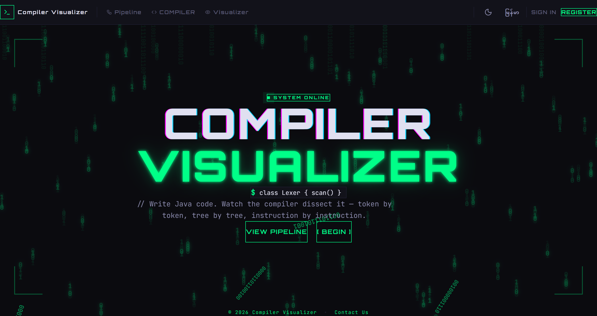
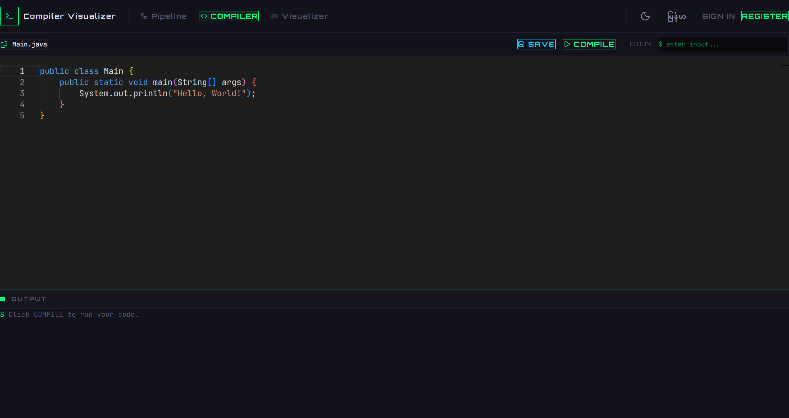
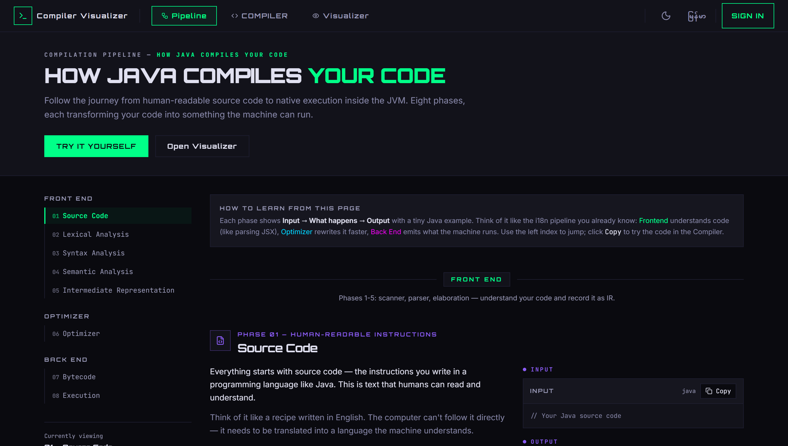
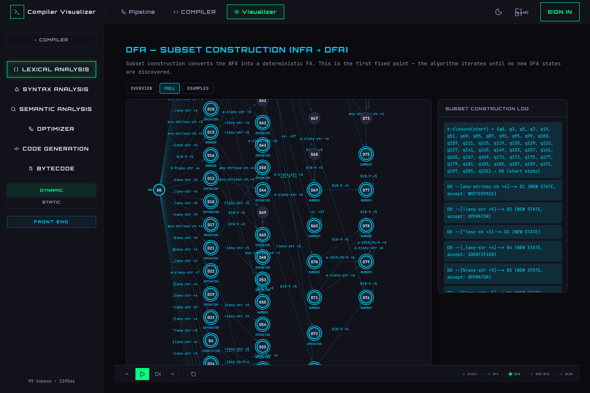
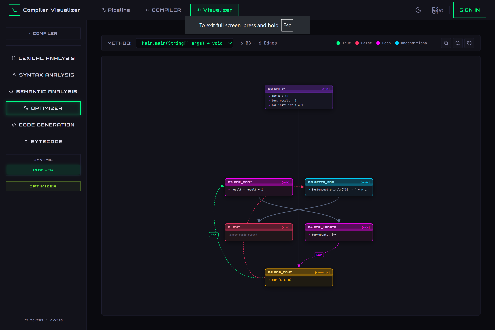

<div align="center">

# ⚡ Compilation Visualizer

[](https://github.com/ThantZ-cloud/Compiler_Visualizer/actions/workflows/ci.yml)
[](https://opensource.org/licenses/MIT)
[](https://nodejs.org/)
[](https://openjdk.org/)
[](https://react.dev/)

### 🎯 Write Java code → Watch the compiler dissect it — token by token, branch by branch, byte by byte.

A full-stack web app that visualizes the **entire Java compilation pipeline** —
lexical analysis, parsing, semantic analysis, optimization, code generation,
and bytecode execution. Write code in a VS Code–grade editor, then explore each
phase through animated algorithm walkthroughs, interactive D3.js graphs, a 3D
Three.js pipeline scene, and raw bytecode disassembly.

**Live:** [Frontend `compiler-visualizer-thant-zin.vercel.app`](https://compiler-visualizer-thant-zin.vercel.app) (Vercel) • [API `compiler-visualizer-api.onrender.com`](https://compiler-visualizer-api.onrender.com) (Render Singapore, Docker JDK) • DB Supabase Postgres `ap-southeast-1` — verified `2026-08-26` Chrome MCP `POST /api/compile → 200 Hello, World!` *(see [DEPLOYMENT.md](DEPLOYMENT.md))*

</div>

---

## 📸 Screenshots

| Screenshot | Description |
|------------|-------------|
|  | Landing Page — terminal typewriter hero + live pipeline preview |
|  | Code Editor — Monaco editor with Java syntax + terminal output |
|  | 3D Pipeline — Three.js walkthrough of the compilation pipeline |
|  | Lexical Analysis — RE → NFA → DFA subset construction walkthrough |
|  | Optimizer — control-flow graph, dominator tree & SSA form |

---

## ✨ Features

- **Full pipeline in one click** — one `POST /api/compile` returns tokens, AST,
  symbol tables, control-flow graphs, three-address code, bytecode, and
  program output with per-phase timings.
- **Animated algorithm walkthroughs** — every phase panel plays its algorithm
  step by step:
  - *Lexical:* Regular expressions → NFA construction → DFA subset
    construction → DFA minimization (Hopcroft's algorithm) → scanner simulation
    (maximal munch)
  - *Syntax:* Pushdown automaton / shift-reduce parsing against Java grammar
    productions → AST construction
  - *Semantic:* Scope tree, symbol table, type resolution & checking
  - *Optimizer:* Basic blocks → dominator tree → SSA form → liveness /
    data-flow analysis → list scheduling
  - *Code generation:* TAC decomposition → basic blocks → instruction
    scheduling → register allocation (graph coloring)
  - *Bytecode:* `javap` disassembly listing → JVM stack machine simulation →
    execution flow
- **Dynamic / static views** — each phase offers an animated pipeline view and
  a static result browser (`?view=static`)
- **LOAD SAMPLE CODE** — every visualization works without the editor; one
  button compiles a built-in factorial sample in place
- **VS Code-like file browser** — save snippets per account (paginated),
  edit and recompile them
- **3D pipeline tour** — Three.js scene walking through all phases
- **Auth** — JWT login/register; saved code is per-user
- **i18n + theming** — English / Myanmar (Burmese) UI, dark / light / system
  themes

---

## ⚛️ Tech Stack

### Frontend

| Tech | Version | Why |
|------|---------|-----|
| [React](https://react.dev/) | 19 | Ultra-fast concurrent rendering |
| [TypeScript](https://www.typescriptlang.org/) | 6 | Strict typing, zero `any` escape hatches |
| [Vite](https://vite.dev/) | 8 | Sub-second HMR + Rolldown bundler |
| [Tailwind CSS](https://tailwindcss.com/) | 4 | Utility-first styling via `@theme` tokens |
| [Monaco Editor](https://microsoft.github.io/monaco-editor/) | — | The same editor that powers VS Code |
| [D3.js](https://d3js.org/) | 7 | AST trees, token charts, CFGs, symbol tables |
| [Three.js](https://threejs.org/) | 0.185 | 3D animated compilation pipeline scene |
| [Framer Motion](https://www.framer.com/motion/) | 12 | Smooth phase transitions |
| [React Router](https://reactrouter.com/) | 7 | Multi-page navigation |
| [i18next](https://www.i18next.com/) | 26 | English + Myanmar locales |
| [Axios](https://axios-http.com/) | 1 | HTTP client with JWT interceptors |
| [ESLint](https://eslint.org/) | 10 | Flat config (typescript-eslint, react-hooks, react-refresh) |

Client-side algorithm engines live in `frontend/src/lib/` — `lexer/`
(RE parser, Thompson NFA, subset construction, Hopcroft minimization,
scanner simulation), `parser/` (grammar + shift-reduce parse simulator),
and `cfg/` (dominators, SSA, data-flow, scheduling, graph-coloring register
allocation, stack machine).

### Backend

| Tech | Version | Why |
|------|---------|-----|
| [Spring Boot](https://spring.io/projects/spring-boot) | 3.2 | Industry-standard Java framework |
| [Java](https://openjdk.org/) | 17 | LTS release |
| [Maven](https://maven.apache.org/) | 3.6+ | Build tool (no wrapper — CI installs Maven directly) |
| [JavaParser](https://javaparser.org/) | 3.25 | AST building + symbol extraction |
| [Spring Security](https://spring.io/projects/spring-security) + JJWT 0.12 | — | Stateless JWT authentication |
| [Spring Data JPA](https://spring.io/projects/spring-data-jpa) | — | ORM layer over Hibernate |
| [SQLite](https://www.sqlite.org/) | — | Dev database (`dev.db`, zero setup) |
| [H2](https://www.h2database.com/) | — | Test database (auto-loaded under `src/test`) |
| [Postgres](https://supabase.com/) (Supabase) | 17 | Production (`prod` profile, `ap-southeast-1` Singapore — MySQL profile retained locally) |
| [Lombok](https://projectlombok.org/) | — | Bye-bye boilerplate |

**Database profiles:** `dev` (default, SQLite) · `test` (H2, JUnit) · `prod` (Supabase Postgres Singapore — `SPRING_PROFILES_ACTIVE=prod`) · `mysql` (legacy local).

---

## ✅ CI / CD

GitHub Actions runs two parallel jobs on every push/PR to `main`
([`.github/workflows/ci.yml`](.github/workflows/ci.yml)):

| Job | Runner | Steps |
|-----|--------|-------|
| 🎨 **Frontend** | `ubuntu-latest` + Node 22 LTS | `npm ci` → `eslint` → `tsc + vite build` |
| ☕ **Backend** | `ubuntu-latest` + Java 17 (Temurin) | `mvn clean package` (compile + JUnit tests) |

Production deploys automatically on push to `main`: **Vercel** rebuilds `frontend/` (`dist`) and **Render** rebuilds the backend Docker image (`eclipse-temurin:17-jdk`). Keep-alive pings `/api/health` every 10 min (see [DEPLOYMENT.md](DEPLOYMENT.md)).

> ℹ️ **Node 22 LTS is required** — Vite 8 enforces
> `engines: ^20.19.0 || >=22.12.0`. With nvm:
> ```bash
> nvm use 22
> ```

---

## 🏃 Getting Started

### Prerequisites

| Tool | Version | Required? |
|------|---------|-----------|
| **Java JDK** | 17+ | ✅ Yes (backend + runs `javac`/`javap`/compiled programs) |
| **Node.js** | 22 LTS | ✅ Yes |
| **Maven** | 3.6+ | ✅ Yes (installed separately — no wrapper in repo) |
| **Postgres (Supabase Free)** | — | ⬜ Production (local dev needs no DB; `mysql` profile still works if you have MySQL) |

### ☕ Backend

```bash
cd backend

# Start the dev server (port 8080) — SQLite dev.db created automatically
mvn spring-boot:run

# Build the jar
mvn clean package

# Run tests (H2 in-memory, auto-configured)
mvn test

# Production profile (Supabase Postgres — see DEPLOYMENT.md for env vars)
SPRING_PROFILES_ACTIVE=prod DB_URL=... DB_USERNAME=... DB_PASSWORD=... JWT_SECRET=... mvn spring-boot:run
# Legacy MySQL profile (local only)
mvn spring-boot:run -Dspring-boot.run.profiles=mysql
```

> 🔐 In production, set the `JWT_SECRET` environment variable — there is no
> fallback outside the dev profile.

### ⚛️ Frontend

```bash
cd frontend

npm install        # install dependencies
npm run dev        # dev server on http://localhost:5173
npm run build      # TypeScript check + Vite production build
npm run lint       # ESLint (flat config)
```

Frontend runs on `http://localhost:5173` and expects the backend on
`http://localhost:8080` (CORS allows 5173/3000 origins by default — configure
via `app.cors.allowed-origins` in `SecurityConfig.java`).

---

## 🏗️ Architecture

### Compilation Pipeline

When you click **Compile & Execute**, the backend runs the full pipeline and
returns everything in a single response:

```
  Source Code (+ stdin)
       │
       ▼
  ┌─────────────────────────────┐
  │ Class detection             │   Multi-file support: finds every class
  └──────────┬──────────────────┘
             ▼
  ┌─────────────┐   ┌─────────────┐
  │ 1. Lexer    │   │ 2. Parser   │   ← Parallel via CompletableFuture
  │  tokens     │   │  AST JSON   │     (JavaLexer / JavaParser)
  └──────┬──────┘   └──────┬──────┘
         └────────┬─────────┘
                  ▼
  ┌─────────────────────────────────┐
  │ 3. Symbol Table Builder         │   ← Walks AST for classes/methods/
  │    scopes, declarations, types  │     fields + type checking
  └──────────────┬──────────────────┘
                 ▼
  ┌─────────────────────────────────┐
  │ 4. CFG + TAC                    │   ← ControlFlowGraphBuilder +
  │    basic blocks, flow edges     │     TacGenerator (three-address code)
  └──────────────┬──────────────────┘
                 ▼
  ┌─────────────────────────────────┐
  │ 5. Bytecode Generation          │   ← javac + javap -c -p per class
  │    JVM disassembly              │
  └──────────────┬──────────────────┘
                 ▼
  ┌─────────────────────────────────┐
  │ 6. Execution                    │   ← Sandboxed child JVM (-Xmx64m),
  │    stdout / stderr / exit code  │     10s timeout, temp files cleaned up
  └─────────────────────────────────┘
```

Hardening & performance:

- **LRU cache** (128 entries) — identical source compiles instantly the second time
- **Rate limiting** per IP — 10 compiles/min, 5 logins/min, 3 registrations/min (`429` when exceeded)
- **10s timeout** per phase — infinite loops can't freeze the server
- **Sandboxed execution** — child JVM capped at `-Xmx64m`, run in a temp dir that is cleaned afterwards

### Project Structure

```
Compiler_Visualizer/
├── .github/workflows/
│   └── ci.yml                      # 🤖 CI workflow (Node 22 + Java 17)
├── frontend/                       # ⚛️ React 19 + TypeScript + Vite
│   └── src/
│       ├── pages/                  # Landing, Editor, Pipeline, About + 6 phase panels
│       ├── components/             # Monaco editor, D3 charts, Three.js scene, shadcn-style UI
│       ├── lib/                    # Client-side algorithm engines (lexer/, parser/, cfg/)
│       ├── context/                # Auth, Compile, Theme, Language providers
│       ├── i18n/                   # English + Myanmar translations
│       ├── services/api.ts         # Axios client (authAPI, compileAPI, codeAPI)
│       └── types/index.ts          # Shared TypeScript interfaces
├── backend/                        # ☕ Spring Boot 3.2 + Java 17
│   └── src/main/java/com/compilervisualizer/
│       ├── controller/             # AuthController, CompileController, CodeController
│       ├── service/                # JavaLexer, AstSerializer, SymbolTableBuilder,
│       │                           #   ControlFlowGraphBuilder, TacGenerator,
│       │                           #   CompileService, CodeExecutor, CodeService,
│       │                           #   RateLimiter/RateLimitGuard, CompileResultCache
│       ├── security/               # JWT provider, filter, UserDetailsService
│       ├── config/                 # SecurityConfig (CORS + filter chain), exception handler
│       ├── dto/                    # Request/response records (Lombok builders)
│       ├── model/                  # User, SavedCode entities
│       └── repository/             # Spring Data JPA repositories
└── screenshots/                    # 📸 App screenshots
```

---

## 🔌 API Endpoints

| Method | Path | Auth | Description |
|--------|------|:----:|-------------|
| `POST` | `/api/auth/register` | — | Register a new user (3 req/min/IP) |
| `POST` | `/api/auth/login` | — | Login → returns JWT (5 req/min/IP) |
| `GET` | `/api/auth/me` | ✅ | Get current user info |
| `POST` | `/api/compile` | — | **Full pipeline**: `{sourceCode, input?, entryClassName?}` → tokens + AST + symbols + CFG + TAC + bytecode + execution output (10 req/min/IP) |
| `POST` | `/api/code` | ✅ | Save a code snippet |
| `GET` | `/api/code/saved?page=0&size=20` | ✅ | List saved snippets (paginated) |
| `PUT` | `/api/code/{id}` | ✅ | Update a snippet |
| `DELETE` | `/api/code/{id}` | ✅ | Delete a snippet |

> ⚡ There is exactly **one** compile endpoint — it always returns the complete
> result bundle so any phase can be visualized without recompiling.
> Exceeding a rate limit returns `429`.

---

## 🧭 Routes

| Route | Page | What you see |
|-------|------|--------------|
| `/` | Landing | Terminal typewriter hero, feature cards, pipeline preview |
| `/about` | About | Project story & tech overview |
| `/pipeline` | 3D Pipeline | Three.js animated compilation pipeline scene |
| `/compiler` | Editor | Monaco editor + terminal output + file browser |
| `/visualize/lexical` | Lexical Analysis | RE → NFA → DFA → Min-DFA → scanner pipeline (or token browser) |
| `/visualize/syntax` | Syntax Analysis | Shift-reduce parsing + D3.js collapsible AST |
| `/visualize/semantic` | Semantic Analysis | Scope tree + symbol table explorer |
| `/visualize/cfg` | Optimizer | CFG, dominator tree, SSA, data-flow, scheduling |
| `/visualize/codegen` | Code Generation | TAC, basic blocks, scheduling, register allocation |
| `/visualize/bytecode` | Bytecode | javap listing, stack machine simulation, execution flow |

Legacy aliases redirect to canonical routes: `/visualize/tokens` → `lexical`,
`/visualize/ast` → `syntax`, `/visualize/optimizer` → `cfg`,
`/visualize/tac` → `codegen`. Every phase supports `?view=static` for the raw
result browser instead of the animated pipeline. Visiting `/visualize/*`
without results shows an empty state with a **LOAD SAMPLE CODE** button.

Each phase panel is tagged with a pipeline badge — FRONT END (cyan),
OPTIMIZER (lime), BACK END (rose) — and labels every visualization with the
algorithm that produced it.

---

## 🎨 Design System

A **cyberpunk terminal** aesthetic — neon green on deep black, JetBrains Mono everywhere.

| Accent | Hex | Usage |
|--------|-----|-------|
| 🟢 Neon | `#00FF88` | Primary actions, active states |
| 🔵 Cyan | `#00D4FF` | Front-end phase badge, secondary info |
| 🟡 Amber | `#FFB000` | Warnings, unsaved changes |
| 🟢 Lime | `#A3E635` | Optimizer phase badge |
| 🔴 Rose | `#FF3366` | Errors, back-end phase badge |

Fonts: **Orbitron** for headings, **JetBrains Mono** for body & code.
Theme tokens live in `frontend/src/index.css` under Tailwind v4 `@theme`.

Includes **dark / light / system** theme toggle and **English / Myanmar**
language switch.

---

## 👥 Team Workflow

```
  main  ──────────┬──────────────────────────┬──────────
                   │                          │
  feat/login  ────┘ work → commit → push → PR ┘ merge
                                                 ↑
                                          CI must pass ✅
                                          Reviewer approves ✅
```

| Rule | Why |
|------|-----|
| Never push directly to `main` | Everyone's code would collide — always use branches |
| One branch per feature/fix | `git checkout -b feat/tokens-panel` |
| Open a PR before merging | Lets teammates review before it goes live |
| Wait for CI ✅ | Don't merge broken code — fix it and re-push |

---

## 📄 License

**MIT** — free to use, modify, and distribute.

<div align="center">

Built with ⚡ by [Thant Zin Htun](https://github.com/ThantZ-cloud)

</div>
